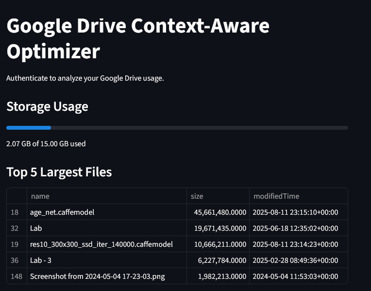
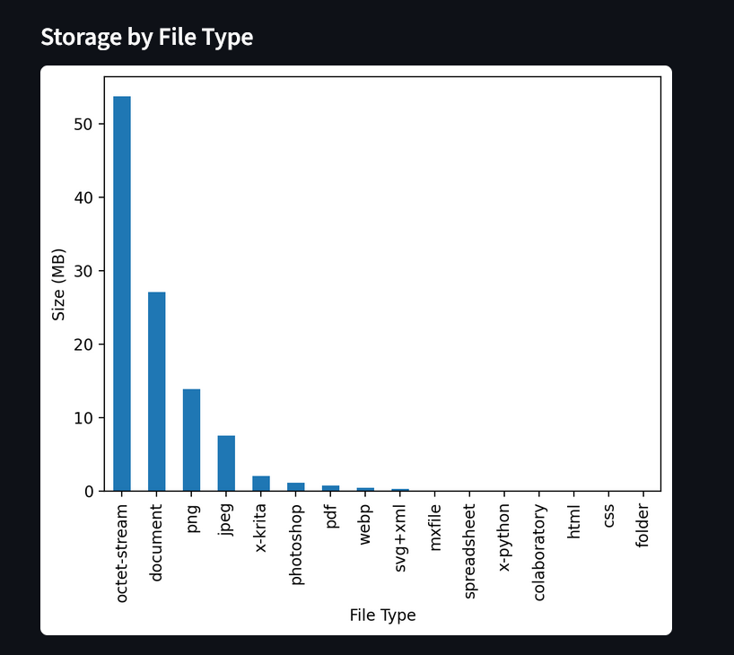
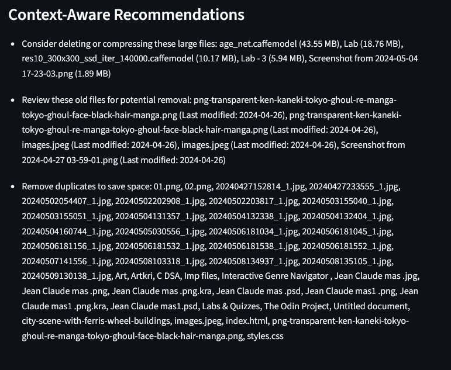
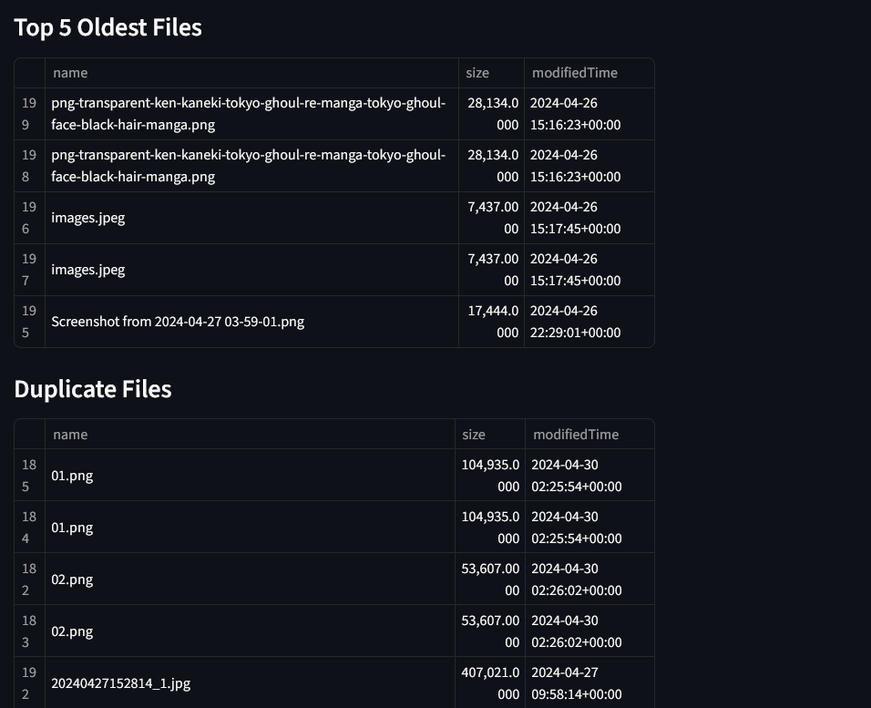

# Google Drive Context-Aware Optimizer


> An intelligent storage optimization tool that analyzes Google Drive usage patterns and provides context-aware recommendations for efficient space management.

## Overview

The Google Drive Context-Aware Optimizer is a Flask-based web application that integrates with the Google Drive API to perform comprehensive storage analysis. It employs intelligent algorithms to categorize files, identify optimization opportunities, and provide actionable insights for storage management.

## Features

### Core Functionality

- **OAuth 2.0 Integration** - Secure authentication with Google Drive API
- **Real-time Storage Analysis** - Dynamic scanning and categorization of drive contents
- **File Type Distribution Analytics** - Visual breakdown of storage consumption by file type
- **Intelligent Duplicate Detection** - Advanced algorithms to identify redundant files
- **Context-Aware Recommendations** - Smart suggestions based on file age, size, and usage patterns

### Analytics Dashboard

- **Storage Usage Visualization** - Interactive charts showing current usage against quota
- **Largest Files Identification** - Ranked list of space-consuming files
- **Temporal Analysis** - Age-based file categorization for cleanup prioritization
- **Duplicate Management Interface** - Streamlined view of redundant files with metadata

## Screenshots

### Storage Analysis Dashboard


*Real-time storage usage overview with quota management*

### File Type Distribution


*Visual breakdown of storage consumption across different file types*

### Context-Aware Recommendations


*Intelligent suggestions for storage optimization based on usage patterns*

### Duplicate Files Management


*Comprehensive duplicate file detection with detailed metadata*

## Installation

### Prerequisites

```bash
Python 3.8+
pip package manager
Google Cloud Console account
```

### Setup

1. **Clone the repository**
   ```bash
   git clone https://github.com/Kushal2205a/Context-Aware-Cloud-Optimizer-for-Google-Drive.git
   cd Context-Aware-Cloud-Optimizer-for-Google-Drive
   ```

2. **Create virtual environment**
   ```bash
   python -m venv venv
   source venv/bin/activate  # On Windows: venv\Scriptsctivate
   ```

3. **Install dependencies**
   ```bash
   pip install -r requirements.txt
   ```

4. **Set up Google Drive API credentials**
   ```bash
   # Create credentials.json in project root
   # Follow Google Drive API setup guide
   ```

## Configuration

### Environment Variables

Create a `.env` file in the project root:

```env
FLASK_APP=app.py
FLASK_ENV=development
SECRET_KEY=your-secret-key
GOOGLE_CLIENT_ID=your-google-client-id
GOOGLE_CLIENT_SECRET=your-google-client-secret
```

### Google Drive API Setup

1. Navigate to [Google Cloud Console](https://console.cloud.google.com/)
2. Create a new project or select existing
3. Enable Google Drive API
4. Create OAuth 2.0 credentials
5. Download `credentials.json` to project root

## Usage

### Starting the Application

```bash
python app.py
```

Navigate to `http://localhost:5000` to access the web interface.

### API Endpoints

```http
GET /auth          # Initiate OAuth flow
GET /callback      # Handle OAuth callback
GET /analyze       # Perform drive analysis
GET /dashboard     # Main dashboard view
```

### Analysis Workflow

1. **Authentication** - Secure OAuth connection to Google Drive
2. **Scanning** - Recursive analysis of drive structure
3. **Categorization** - File type and metadata extraction
4. **Analysis** - Pattern recognition and optimization identification
5. **Recommendations** - Context-aware suggestions generation

## API Reference

### Drive Analysis

```python
from optimizer import DriveAnalyzer

analyzer = DriveAnalyzer(credentials)
results = analyzer.analyze_storage()

# Returns:
# {
#   'file_types': {...},
#   'largest_files': [...],
#   'oldest_files': [...],
#   'duplicates': [...],
#   'recommendations': [...]
# }
```

### File Operations

```python
# Get file metadata
file_info = analyzer.get_file_details(file_id)

# Identify duplicates
duplicates = analyzer.find_duplicates()

# Generate recommendations
recommendations = analyzer.generate_recommendations()
```

## Architecture

### System Components

```
┌─────────────────┐    ┌──────────────────┐    ┌─────────────────┐
│   Frontend      │────│  Flask Backend   │────│  Google Drive   │
│ (Streamlit lib) │    │   (Python/API)   │    │      API        │
└─────────────────┘    └──────────────────┘    └─────────────────┘
         │                       │                       │
         └───────────────────────┼───────────────────────┘
                                 │
                    ┌──────────────────┐
                    │   Data Analysis  │
                    │     Engine       │
                    └──────────────────┘
```

### Technology Stack

- **Backend**: Python 3.8+, Flask 2.0+
- **Authentication**: OAuth 2.0, Google API Client
- **Frontend**: Streamlit library
- **API Integration**: Google Drive API v3


